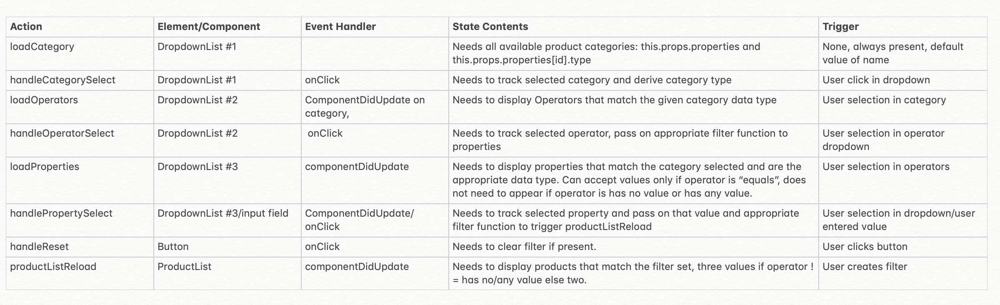

**disclaimer!! I realize this is a little late and have not implemented tests yet, I just wanted to get a functional app in front of you today 08/29/19 and will continue adding to this later on. 
Total time spent is about 3 evenings worth so far. 
A lot of that time went to refamiliarizing myself with javascript and react. 

The first step I took was laying out the actions,elements/components, and some notes on the various states I was expecting to have to manage given the specs and dataset provided. I opted to keep the ui close to the wireframes provided for the sake of keeping it simple.

##User flow choices and assumptions
* Flow 
    - decided to make the filter controls available in sequence
    There has to be a property chosen in order for the operator dropdown to appear
        -from that point a propval selection/input field is only available when the operator is not has any/has no value
        (these didnt require any user input, so I didnt want to introduce that as an option)
        -clear filter is also not available until a property is chosen 
        (this is what toggles the filterOn piece of state)
* assumptions
    - assumed that contains and is any of would be the only operators that require user input vs user selection

##Components
The app is split into two main components (found in src/components)

* ControlRow 
    - This is responsible primarily for displaying the dropdowns/user inputs/ and clear filter and taking in all user events
    - There is a little bit of logic in there, just a few ternary statements that decide whether the dropdown should show up or not/what form it should take depending on the current state of the application
        - this component may benefit from being broken down further, but I'd want to reconsider my state management, as of right now everything is being handled through passing props from the outer container component (ConditionalProdTable). 
        I'd likely use the context api to make use of a global state I can access easily from whatever components are wrapped by the provider.
* ProductList 
    - This is purely display and is a stateless component, it simply reads the props sent down and produces the rows on the      table based on whats changed. 

##Styling
All the styling was put into a separate styling folder, there's a css file that corresponds to each component. 

##Utils
The utils folder is where all of the filtering functions and a few objects mapping relationships are stored. I didnt want any of this cluttering the container component ConditionalProdTable 

* relationships is an object that I use to lookup which operators should be available to each datatype
* helperfunc is an object used to lookup the smaller functions for each operator
    - has any value and has no value are not featured here, I ended up putting them straight into the filterProducts function
* propertyLookup returns an object that holds the id and type of each property
* filterOperators returns operators based on the selected property
* filterProductVals takes a property and returns all of the product values that have the same id
* last but very much the most complex is filterProducts, this takes the property, operator and selected property value and returns an array of products

----
This project was bootstrapped with [Create React App](https://github.com/facebook/create-react-app).

In the project directory, you can run:

### `npm start` <-- use this! :)

Runs the app in the development mode. 
Open [http://localhost:3000](http://localhost:3000) to view it in the browser.

The page will reload if you make edits. 
You will also see any lint errors in the console.

